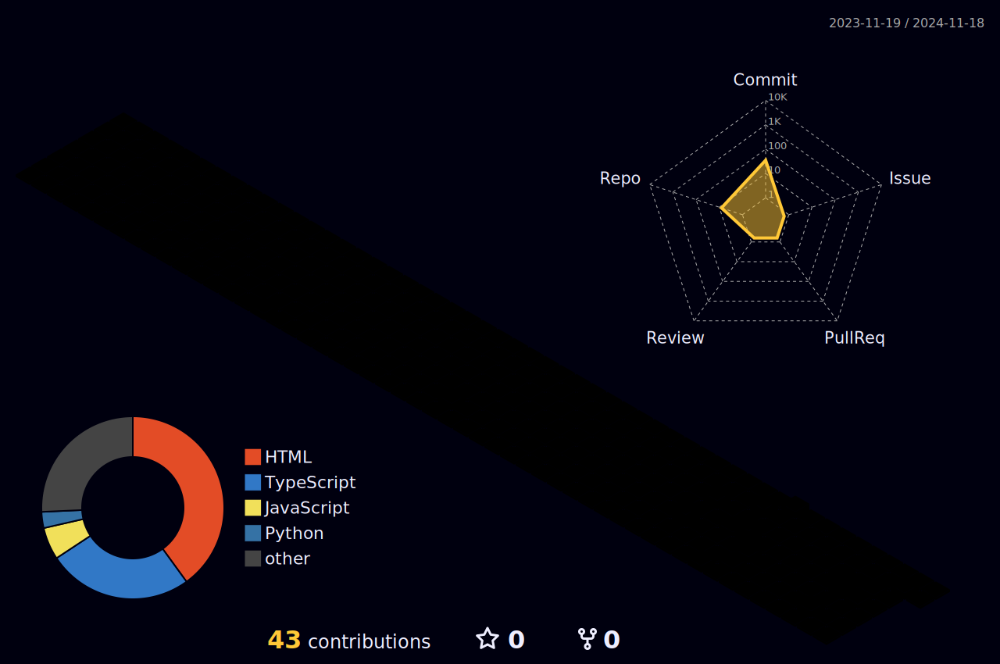

<h1 align="center"> Olá, eu me chamo Ana!😼 </h1>

&nbsp;&nbsp;&nbsp;&nbsp; - 🖥️ Estudante de Ánalise e Desenvolvimento de sistemas.  
&nbsp;&nbsp;&nbsp;&nbsp; - 🎨 Entusiasta de Front-End.  
&nbsp;&nbsp;&nbsp;&nbsp; - 📫 Onde me encontrar? ⬇️  

 

&nbsp;&nbsp;&nbsp;&nbsp;  
&nbsp;&nbsp;&nbsp;&nbsp; 

 
 

  
 |  |  |  
 | ----------- | ----------- |

  <h2 align="center"> Tecnologias que utilizo atualmente </h2>
  
   

##

  

